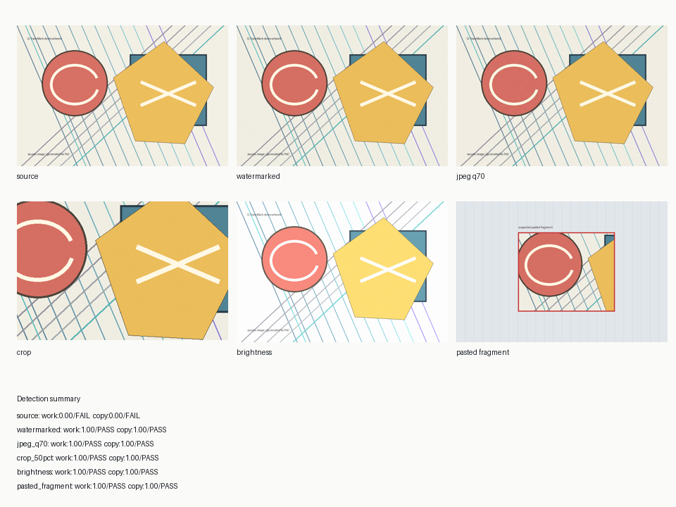

# Q-TraceMark

**EVK QRNG 기반 사본별 이미지 포렌식 지문 발급 및 저작권 추적 시스템**

Q-TraceMark는 이미지에 보이지 않는 워터마크를 단순히 삽입하는 프로젝트가 아닙니다.
EVK QRNG에서 생성한 물리 난수로 작품별·사본별 forensic fingerprint를 발급하고,
난수 품질, seed hash, 발급 시각, 검출 신뢰도까지 묶어 저작권 분쟁에 사용할 수 있는
증거 패키지를 만드는 것을 목표로 합니다.

> 이미지를 막지 않는다. 남은 조각만으로도 출처를 증명한다.

## 핵심 아이디어

- `work_id`: 어떤 원작품인지 추적하는 작품 지문
- `copy_id`: 어느 사용자/플랫폼/세션에 발급된 사본인지 추적하는 유통 지문
- `QRNG seed`: EVK QRNG 원시 난수에서 파생한 예측 불가능한 지문 생성 원천
- `evidence package`: 원본 hash, QRNG seed hash, 난수 품질 리포트, 검출 confidence를 포함한 감사 로그

워터마크는 이미지의 픽셀에 로고를 숨기는 방식이 아니라, DCT 중주파수 계수에
QRNG seed로 생성한 spread-spectrum 신호를 약하게 분산 삽입합니다.

## 왜 QRNG인가

QRNG가 워터마크를 마법처럼 더 안 지워지게 만드는 것은 아닙니다. 강건성은
DCT/wavelet 설계, 반복 삽입, 오류정정, 검출 알고리즘이 결정합니다.

Q-TraceMark에서 QRNG의 역할은 다음입니다.

- 워터마크 seed의 물리적 비예측성 제공
- 작품별·사본별 seed 재사용 위험 감소
- 발급 과정에 대한 난수 품질 리포트 생성
- 사후 조작을 어렵게 하는 seed hash 및 timestamp commitment 제공

즉 Q-TraceMark의 차별점은 **비가시성 워터마크 기술 자체**가 아니라
**QRNG 기반 발급 공증·감사·증거화 레이어**입니다.

## 빠른 실행

```bash
python3 scripts/run_demo.py
```

EVK QRNG 파일을 직접 사용할 때:

```bash
python3 scripts/run_demo.py --qrng-file /path/to/evk_C_1MB.bin
```

결과물은 `results/demo/`에 생성됩니다.

- `source.png`: 원본 예시 이미지
- `watermarked.png`: work/copy 지문이 삽입된 이미지
- `attack_crop.png`: 크롭 공격 이미지
- `attack_jpeg.jpg`: JPEG 압축 공격 이미지
- `attack_paste.png`: 일부 조각 합성 공격 이미지
- `report.json`: 검출 결과와 증거 패키지
- `contact_sheet.png`: 발표용 요약 이미지

## 데모 프리뷰



예시 데모에서는 워터마크가 없는 원본은 검출되지 않고, 워터마크 삽입본·JPEG 압축본·
50% 크롭본·밝기 변형본·부분 합성 ROI에서 work/copy 지문이 검출됩니다.
상세 수치는 [`docs/assets/demo_report.json`](docs/assets/demo_report.json)에 포함되어 있습니다.

## 오탐률 확인

검출기는 crop offset을 모르는 상황을 가정해 17x17개의 phase 후보를 탐색합니다.
따라서 단일 z-test confidence를 그대로 쓰면 false positive가 부풀려질 수 있습니다.
현재 PoC는 Bonferroni 보정을 적용하여 `confidence = 1 - corrected_p_value`로 보고하고,
기본 threshold는 `0.95`입니다.

무워터마크 대조군에서 경험적 FPR을 측정하려면:

```bash
python3 scripts/measure_fpr.py --samples 12
```

예시 결과는 [`docs/assets/fpr_report.json`](docs/assets/fpr_report.json)에 포함되어 있습니다.

보고서용으로는 실제 EVK QRNG 파일과 더 많은 대조군을 사용하세요.

```bash
python3 scripts/measure_fpr.py --qrng-file /path/to/evk_C_1MB.bin --samples 100
```

## 프로젝트 구조

```text
Q-TraceMark/
  docs/
    PROJECT_BRIEF.md
    EXPERIMENT_PLAN.md
    ARCHITECTURE.md
  examples/
    README.md
  results/
    .gitkeep
  scripts/
    qtracemark.py
    run_demo.py
    measure_fpr.py
  tests/
    test_qtracemark.py
```

## 현재 PoC의 범위

이 PoC는 연구/발표용 최소 구현입니다.

- DCT 기반 spread-spectrum 삽입/검출
- 작품 지문과 사본 지문 2계층 삽입
- JPEG 압축, 크롭, 부분 합성 공격 예시
- 후보 seed registry 기반 검출
- Bonferroni 보정 confidence score와 evidence hash 출력
- 무워터마크 대조군 기반 경험적 FPR 측정 스크립트

실서비스 수준으로 가려면 SIFT/ORB 정렬, 오류정정코드, 대규모 seed index,
충돌/오탐 분석, 법적 timestamping, 개인정보 보호 설계가 추가되어야 합니다.
