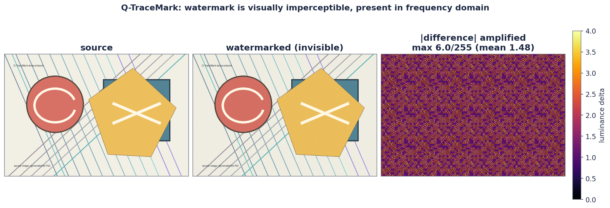
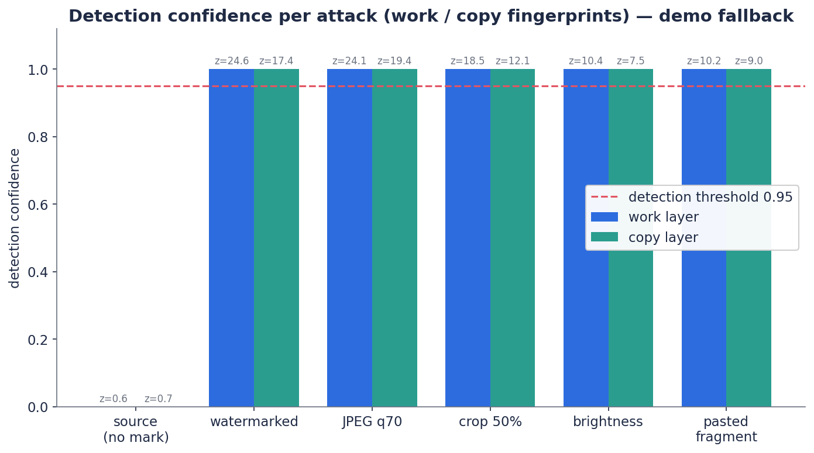
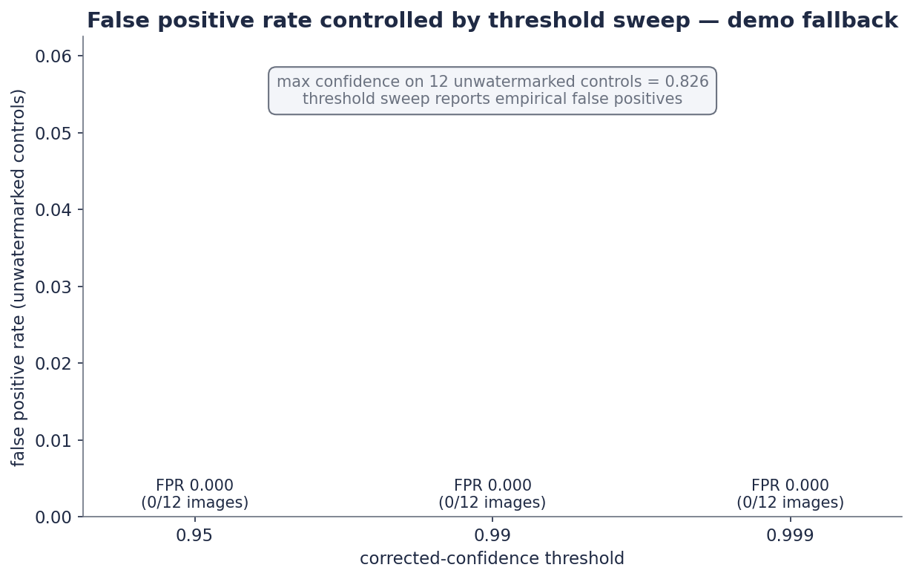
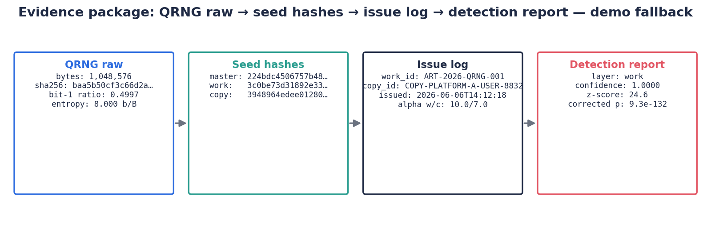

<div align="center">

# 🔍 Q-TraceMark

**EVK QRNG 기반 사본별 이미지 포렌식 지문 발급 및 저작권 추적 시스템**

`work·copy 2계층 지문` · `DCT spread-spectrum` · `QRNG 발급 공증` · `감사 가능한 증거 패키지`

</div>

Q-TraceMark는 이미지에 보이지 않는 워터마크를 단순히 삽입하는 프로젝트가 아닙니다.
EVK QRNG에서 생성한 물리 난수로 작품별·사본별 forensic fingerprint를 발급하고,
난수 품질, seed hash, 발급 시각, 검출 신뢰도까지 묶어 저작권 분쟁에 사용할 수 있는
**증거 패키지**를 만드는 것을 목표로 합니다.

---

## 한눈에 보기

원본 · 워터마크 삽입본 · 공격본(JPEG/크롭/밝기/부분합성)과 검출 요약을 한 장에 담은 컨택트 시트:


| 지표 | 결과 |
|---|---|
| 비가시성 (워터마크 화질 영향) | **PSNR ≈ 41 dB** (육안 구분 거의 불가) |
| 공격 강건성 | JPEG·50% 크롭·밝기·부분합성 **전부 검출** |
| 오탐률 (threshold 0.999) | **FPR 0%** (무워터마크 대조군 100장 기준) |
| 지문 계층 | **work**(작품) + **copy**(사본) 2계층 동시 검출 |

> 💡 위 산출물 전체를 인터랙티브 웹 대시보드(비교 슬라이더 · 공격 강도 차트 · 검증 보고서)로
> 보려면 [`scripts/build_web_report.py`](scripts/build_web_report.py)를 실행하세요. (아래 [웹 대시보드](#웹-대시보드) 참고)

---

## 작동 원리


워터마크는 이미지의 픽셀에 로고를 숨기는 방식이 아니라, DCT 중주파수 계수에
QRNG seed로 생성한 spread-spectrum 신호를 약하게 분산 삽입합니다.

- `work_id`: 어떤 원작품인지 추적하는 **작품 지문**
- `copy_id`: 어느 사용자/플랫폼/세션에 발급된 사본인지 추적하는 **유통 지문**
- `QRNG seed`: EVK QRNG 원시 난수에서 파생한 **예측 불가능한** 지문 생성 원천
- `evidence package`: 원본 hash, QRNG seed hash, 난수 품질 리포트, 검출 confidence를 포함한 **감사 로그**

보이지 않는 워터마크의 실제 모습(원본 / 워터마크 / 증폭한 차이):



## 왜 QRNG인가

QRNG가 워터마크를 마법처럼 더 안 지워지게 만드는 것은 아닙니다. 강건성은
DCT/wavelet 설계, 반복 삽입, 오류정정, 검출 알고리즘이 결정합니다.

Q-TraceMark에서 QRNG의 역할은 다음입니다.

- 워터마크 seed의 **물리적 비예측성** 제공 (안 본 사본의 seed를 추측 불가)
- 작품별·사본별 **seed 재사용·충돌 위험 감소**
- 발급 과정에 대한 **난수 품질 리포트** 생성
- 사후 조작을 어렵게 하는 **seed hash 및 timestamp commitment** 제공

즉 Q-TraceMark의 차별점은 **비가시성 워터마크 기술 자체**가 아니라
**QRNG 기반 발급 공증·감사·증거화 레이어**입니다.

## 검출·오탐·증거

| 공격별 검출 신뢰도 | threshold별 오탐률 |
|:---:|:---:|
|  |  |

발급 시 함께 남는 증거 패키지 구성:



---

## 빠른 실행

```bash
python3 scripts/run_demo.py
```

EVK QRNG 파일을 직접 사용할 때:

```bash
python3 scripts/run_demo.py --qrng-file /path/to/evk_C_1MB.bin
```

결과물은 `results/demo/`에 생성됩니다.

- `source.png`: 원본 예시 이미지
- `watermarked.png`: work/copy 지문이 삽입된 이미지
- `attack_crop.png`: 크롭 공격 이미지
- `attack_jpeg.jpg`: JPEG 압축 공격 이미지
- `attack_paste.png`: 일부 조각 합성 공격 이미지
- `report.json`: 검출 결과와 증거 패키지
- `contact_sheet.png`: 로컬 시각 요약 이미지

예시 데모에서는 워터마크가 없는 원본은 검출되지 않고, 워터마크 삽입본·JPEG 압축본·
50% 크롭본·밝기 변형본·부분 합성 ROI에서 work/copy 지문이 검출됩니다.
상세 수치는 [`docs/assets/demo_report.json`](docs/assets/demo_report.json)에 포함되어 있습니다.

## 웹 대시보드

발급·공격·검출·검증 전 과정을 한 페이지로 보는 자체 완결형 웹 대시보드를 생성합니다
(비교 슬라이더, 공격 강도별 인터랙티브 차트, 검증 보고서 전체 포함).

```bash
# 실제 사진으로 전체 파이프라인 실행 후 대시보드 빌드
python3 scripts/run_image_experiment.py --image /path/to/photo.jpg --out results/photo_experiment
python3 scripts/make_photo_research_figures.py --image /path/to/photo.jpg --out results/photo_research_figures
python3 scripts/run_validation_suite.py --samples 100 --out results/photo_validation/validation_report.json
python3 scripts/build_web_report.py

# 열기
open results/web/index.html            # 또는
python3 -m http.server -d results/web 8000   # → http://localhost:8000
```

`results/photo_experiment` 등 실제 산출물이 없으면 커밋된 `docs/assets` 예시로 자동 폴백합니다.

## 오탐률 확인

검출기는 crop offset을 모르는 상황을 가정해 17x17개의 phase 후보를 탐색합니다.
따라서 단일 z-test confidence를 그대로 쓰면 false positive가 부풀려질 수 있습니다.
현재 PoC는 Bonferroni 보정을 적용하여 `confidence = 1 - corrected_p_value`로 보고하고,
기본 threshold는 `0.95`입니다.

무워터마크 대조군에서 경험적 FPR을 측정하려면:

```bash
python3 scripts/measure_fpr.py --samples 12
```

예시 결과는 [`docs/assets/fpr_report.json`](docs/assets/fpr_report.json)에 포함되어 있습니다.

기본적으로 `--thresholds 0.95,0.99,0.999`에 대해 threshold별 false positive count와 FPR을
함께 출력합니다.

보고서용으로는 실제 EVK QRNG 파일과 더 많은 대조군을 사용하세요.

```bash
python3 scripts/measure_fpr.py --qrng-file /path/to/evk_C_1MB.bin --samples 100
```

## Report-grade validation

합성 이미지가 아니라 **실제 사진/텍스처 대조군**에서 검출률과 오탐률을 한 번에 검증하고
단일 리포트로 남기려면 검증 스위트를 실행합니다.

```bash
python3 scripts/run_validation_suite.py
```

워터마크가 들어가지 않은 실제 사진 폴더를 대조군으로 쓰려면 `--controls-dir`을 지정합니다
(폴더에 이미지가 없으면 자동으로 합성 대조군으로 폴백합니다).

```bash
python3 scripts/run_validation_suite.py --controls-dir data/controls --samples 100
```

`measure_fpr.py`도 동일하게 실제 사진 폴더를 받을 수 있습니다.

```bash
python3 scripts/measure_fpr.py --controls-dir data/controls --samples 100
```

검증 스위트는 다음을 한 리포트에 담습니다.

- 워터마크 삽입본 + 공격본(JPEG, 크롭, 밝기, 부분 합성) 검출 결과
- 무워터마크 대조군 기반 경험적 FPR
- threshold 0.95 / 0.99 / 0.999 sweep

결과는 `results/validation/validation_report.json`에만 저장됩니다(기본값).
공개 예시 리포트인 [`docs/assets/validation_report.json`](docs/assets/validation_report.json)을
함께 갱신하려면 `--update-docs`를 명시합니다. 기본 실행은 작업 트리를 더럽히지 않습니다.

## Actual EVK QRNG run

> ⚠️ **Seed status.** The committed `evk_C_1MB.bin` numbers below are a
> **reproduction record only**. That file was briefly published in Git history and
> is treated as compromised, so it has been purged and must not be reused. For
> final / dispute-grade runs, collect a **fresh EVK capture**, keep it only locally
> in `data/qrng/` (never commit raw `.bin`), and rerun the commands below against
> the new file. See [`docs/EVK_EXPERIMENT_REPORT.md`](docs/EVK_EXPERIMENT_REPORT.md)
> and [`data/qrng/README.md`](data/qrng/README.md).

Place the class EVK QRNG raw bitstreams under `data/qrng/`. Raw `.bin` files are
ignored by Git, while derived hashes/statistics are committed under `docs/assets/`.
The example below uses `data/qrng/evk_C_1MB.bin`; substitute your fresh capture's
filename for real runs.

```bash
python3 scripts/analyze_qrng_files.py --data-dir data/qrng
python3 scripts/run_demo.py --qrng-file data/qrng/evk_C_1MB.bin --out results/evk_demo
python3 scripts/measure_fpr.py --qrng-file data/qrng/evk_C_1MB.bin --samples 100 --out results/evk_fpr/fpr_report.json
```

EVK `C` quality summary:

- SHA-256: `f80e1b6577c1c2439c6d71e66d6cd4c24ab7fd6701021358b7c822d031e8cf14`
- bit-one ratio: `0.5001698732`
- byte entropy: `7.9998220231` bits/byte
- longest run: `23` bits

EVK 실행 그림 (공격별 검출 / threshold별 오탐 / 증거 패키지):

|  |  |  |
|:---:|:---:|:---:|

EVK report assets:

- [`docs/EVK_EXPERIMENT_REPORT.md`](docs/EVK_EXPERIMENT_REPORT.md)
- [`docs/assets/evk_qrng_quality_report.json`](docs/assets/evk_qrng_quality_report.json)
- [`docs/assets/evk_demo_report.json`](docs/assets/evk_demo_report.json)
- [`docs/assets/evk_fpr_report.json`](docs/assets/evk_fpr_report.json)
- [`docs/assets/evk_validation_report.json`](docs/assets/evk_validation_report.json)

In the committed EVK FPR sweep, threshold `0.95` produced `4/100` synthetic-control
false positives, threshold `0.99` produced `1/100`, and threshold `0.999` produced
`0/100`. For report-grade or dispute-grade claims, use `0.999` unless a larger
empirical null set justifies a lower threshold.

## Real Photo Experiment

사용자 제공 사진이나 실제 작품 이미지로 PoC를 돌리려면 `run_image_experiment.py`를 사용합니다.
원본 이미지는 Git에 커밋하지 말고 로컬 경로에서 직접 읽어 `results/`에 산출물을 만듭니다.

```bash
python3 scripts/run_image_experiment.py \
  --image /path/to/source_photo.jpg \
  --qrng-file data/qrng/<fresh_capture>.bin \
  --out results/photo_experiment \
  --max-long-edge 1536
```

생성물:

- `source_resized.png`, `watermarked.png`
- JPEG/crop/brightness/pasted-fragment 공격 이미지
- `contact_sheet.png`: 로컬 시각 요약 이미지
- `diff_figure.png`: 원본/워터마크/증폭 차이
- `confidence_figure.png`: 공격별 work/copy confidence

논문/포스터 스타일의 보조 실험 그림(JPEG sweep, crop/fragment sweep, null distribution,
PSNR/차이 분포)을 생성하려면:

```bash
python3 scripts/make_photo_research_figures.py \
  --image /path/to/source_photo.jpg \
  --qrng-file data/qrng/<fresh_capture>.bin \
  --out results/photo_research_figures \
  --max-long-edge 1536
```

## 프로젝트 구조

```text
Q-TraceMark/
  data/
    qrng/
      README.md
      *.bin  (local only; ignored by Git)
  docs/
    PROJECT_BRIEF.md
    EXPERIMENT_PLAN.md
    ARCHITECTURE.md
    EVK_EXPERIMENT_REPORT.md
    assets/            # 커밋된 예시 리포트(JSON) + README 그림(fig_*, evk_fig_*)
  examples/
    README.md
  results/
    .gitkeep
  scripts/
    qtracemark.py
    run_demo.py
    measure_fpr.py
    run_validation_suite.py
    run_image_experiment.py
    make_photo_research_figures.py
    make_figures.py
    analyze_qrng_files.py
    build_web_report.py
  tests/
    test_qtracemark.py
```

## 현재 PoC의 범위

이 PoC는 연구용 최소 구현입니다.

- DCT 기반 spread-spectrum 삽입/검출
- 작품 지문과 사본 지문 2계층 삽입
- JPEG 압축, 크롭, 부분 합성 공격 예시
- 후보 seed registry 기반 검출
- Bonferroni 보정 confidence score와 evidence hash 출력
- 무워터마크 대조군 기반 경험적 FPR 측정 스크립트
- 실제 사진 대조군 + threshold sweep을 포함한 report-grade 검증 스위트
- 실제 EVK QRNG raw bitstream 기반 seed 발급과 품질 리포트
- 발급·검출·검증을 한 페이지로 보는 인터랙티브 웹 대시보드

실서비스 수준으로 가려면 SIFT/ORB 정렬, 오류정정코드, 대규모 seed index,
충돌/오탐 분석, 법적 timestamping, 개인정보 보호 설계가 추가되어야 합니다.
