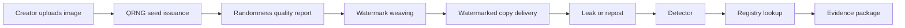

# Q-TraceMark 아키텍처

## 전체 흐름



## 발급 계층

Q-TraceMark는 하나의 seed만 쓰지 않습니다. 목적별로 계층을 나눕니다.

| 계층 | 의미 | 생성 시점 |
|---|---|---|
| `work_seed` | 원작품 식별 | 최초 등록 시 |
| `copy_seed` | 사용자/플랫폼 사본 식별 | 조회, 다운로드, 렌더링 시 |
| `session_seed` | 고위험 콘텐츠 세션 추적 | 선택적으로 실시간 발급 |

## Watermark Weaving

워터마크는 한 지점에 도장을 찍듯 넣지 않고, 이미지 전체에 직조하듯 분산 삽입합니다.

```text
work_id      = 굵은 실: 작품 전체에 반복
platform_id  = 중간 실: 플랫폼별 배포 경로
copy_id      = 얇은 실: 사용자/세션별 사본 경로
```

검출 시에는 남아 있는 조각에서 correlation peak를 찾아 어떤 실이 남아 있는지 복원합니다.

## PoC 삽입 방식

현재 PoC는 YCbCr의 Y 채널을 사용합니다.

1. RGB 이미지를 YCbCr로 변환
2. Y 채널을 8x8 블록으로 분할
3. 각 블록에 2D DCT 적용
4. QRNG seed로 선택한 중주파수 계수에 `+alpha` 또는 `-alpha` 삽입
5. inverse DCT로 이미지 복원

주파수 계수는 DC 성분과 고주파 끝단을 피하고, 중주파 영역만 사용합니다.

## 검출 방식

1. 의심 이미지의 Y 채널을 DCT로 변환
2. registry의 후보 seed를 사용해 동일한 계수 위치와 부호를 재생성
3. `sum(sign * coefficient)` 형태의 correlation score 계산
4. z-score와 confidence score 산출
5. threshold 이상이면 해당 work/copy seed 검출

## 유통 경로 추적

작품 지문과 사본 지문을 동시에 읽으면 다음과 같이 경로를 재구성할 수 있습니다.

```text
work_id ART-2026-0017
  -> platform_id WEBTOON-A
  -> copy_id USER-8832
  -> repost image detected
```

이는 "인터넷 전체 경로를 자동 추적"하는 기술이 아니라, Q-TraceMark가 발급한 사본
기록을 기준으로 유출 출발점을 좁히는 포렌식 기술입니다.

