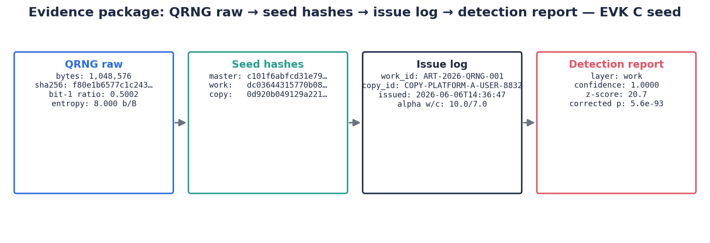

# EVK QRNG Experiment Report

## Summary

This report records the Q-TraceMark run using the real EVK QRNG bitstreams placed
locally in `data/qrng/`. Raw `.bin` files are ignored by Git; the public repository
stores derived hashes, entropy summaries, and validation reports. The primary
watermark seed source is `evk_C_1MB.bin`.

The experiment demonstrates that Q-TraceMark can issue watermark seeds from the
class EVK QRNG files, preserve the seed quality report in the evidence package,
and detect work/copy fingerprints after JPEG compression, crop, brightness
change, and pasted-fragment attacks.

> **Seed status.** The `evk_C_1MB.bin` used for this run was briefly published in
> Git history before being purged, so it is considered compromised and is retained
> only as a reproducibility record (hashes/statistics below). Final and
> dispute-grade runs should use a freshly collected EVK capture that has never been
> committed. See [`data/qrng/README.md`](../data/qrng/README.md).

## Primary EVK Seed Source

| Field | Value |
|---|---:|
| File | `data/qrng/evk_C_1MB.bin` |
| Bytes | 1,048,576 |
| SHA-256 | `f80e1b6577c1c2439c6d71e66d6cd4c24ab7fd6701021358b7c822d031e8cf14` |
| Bit-one ratio | 0.5001698732 |
| Byte entropy | 7.9998220231 bits/byte |
| Longest bit run | 23 |

Full QRNG quality report:

- [`docs/assets/evk_qrng_quality_report.json`](assets/evk_qrng_quality_report.json)

## Detection Results

The EVK demo report is stored at:

- [`docs/assets/evk_demo_report.json`](assets/evk_demo_report.json)
- [`docs/assets/evk_demo_contact_sheet.png`](assets/evk_demo_contact_sheet.png)

All attacked watermarked images passed detection, while the unwatermarked source
image remained below threshold.


## False Positive Rate Sweep

The EVK FPR report is stored at:

- [`docs/assets/evk_fpr_report.json`](assets/evk_fpr_report.json)
- [`docs/assets/evk_validation_report.json`](assets/evk_validation_report.json)

Synthetic unwatermarked controls were used for the committed report. The result
shows why threshold sweeping is necessary for evidence-style claims.

| Corrected-confidence threshold | False positives | FPR |
|---:|---:|---:|
| 0.95 | 4 / 100 | 0.04 |
| 0.99 | 1 / 100 | 0.01 |
| 0.999 | 0 / 100 | 0.00 |

For report-grade or dispute-grade claims, Q-TraceMark should use `0.999` as the
decision threshold unless a larger empirical null set justifies a lower value.


## Evidence Package Figure



## Exact Commands

```bash
python3 scripts/analyze_qrng_files.py --data-dir data/qrng --out docs/assets/evk_qrng_quality_report.json
python3 scripts/run_demo.py --qrng-file data/qrng/evk_C_1MB.bin --out results/evk_demo
python3 scripts/measure_fpr.py --qrng-file data/qrng/evk_C_1MB.bin --samples 100 --out results/evk_fpr/fpr_report.json
python3 scripts/run_validation_suite.py --qrng-file data/qrng/evk_C_1MB.bin --samples 100 --out results/evk_validation/validation_report.json --no-docs
```
