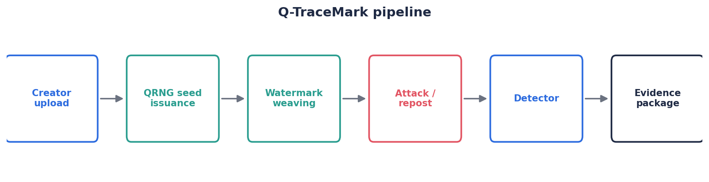
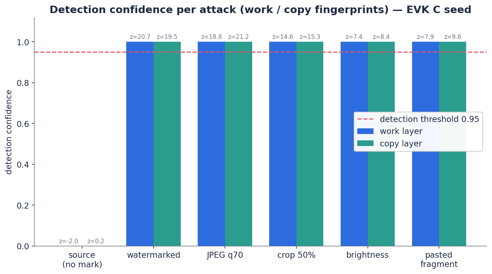
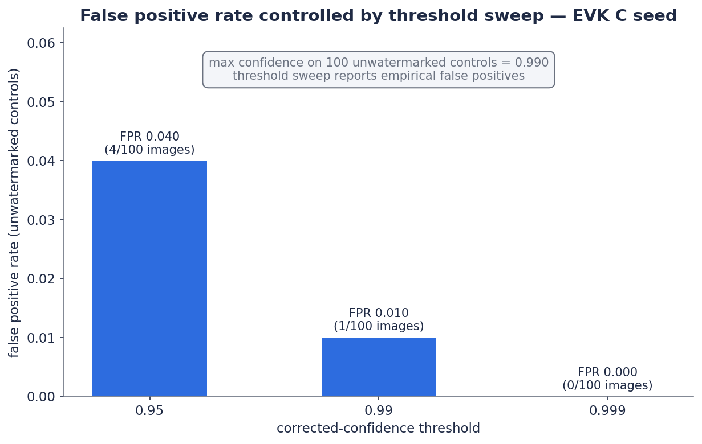

# Q-TraceMark 프로젝트 제안서

## 1. 프로젝트명

**Q-TraceMark: EVK QRNG 기반 사본별 이미지 포렌식 지문 발급 및 저작권 추적 시스템**

## 2. 문제 정의

이미지 저작권 보호는 음악·영상에 비해 추적 체계가 약합니다. SNS나 커뮤니티에
업로드되는 이미지는 다음 변형을 쉽게 겪습니다.

- 메타데이터 삭제
- JPG 압축과 리사이즈
- 크롭 및 부분 합성
- 색 보정과 필터 적용
- AI 업스케일링 또는 노이즈 제거

파일 hash나 메타데이터 기반 출처 증명은 이런 변형에 취약합니다. 기존 이미지 검색은
"비슷한 이미지"를 찾을 수 있지만, 특정 작품과 특정 발급 사본의 관계를 법적 증거처럼
구성하기에는 한계가 있습니다.

## 3. 제안 기술

Q-TraceMark는 이미지를 차단하는 DRM이 아니라, 이미지 안에 작품별·사본별
forensic fingerprint를 삽입하여 사후 추적을 가능하게 하는 시스템입니다.

핵심은 다음 세 계층입니다.

- **작품 지문**: 이미지가 어떤 원작품에서 왔는지 식별
- **사본 지문**: 어느 사용자, 플랫폼, 세션에 발급된 사본인지 식별
- **증거 패키지**: QRNG seed hash, 원본 hash, 발급 시각, 난수 품질, 검출 신뢰도 기록
- **오탐 통제**: 다중비교 보정 p-value와 경험적 FPR 측정

## 4. QRNG의 역할

QRNG는 이미지 유사성을 판단하는 장치가 아닙니다. 이미지 분석은 컴퓨터 비전과
통계 검출이 담당합니다. QRNG는 워터마크 지문의 물리적 엔트로피 소스입니다.

EVK QRNG에서 얻은 원시 난수는 다음 절차를 거칩니다.

1. 원시 bitstream 수집
2. bit balance, entropy, longest run 등 품질 검사
3. SHA-256 기반 seed derivation
4. seed hash 및 raw data hash 저장
5. seed로 워터마크 위치, 부호, 패턴 생성

따라서 Q-TraceMark의 주장은 "양자라서 지워지지 않는다"가 아닙니다.
"이 지문이 예측 불가능한 물리 난수에서 특정 시점에 발급되었다"는 증거성을 강화하는
것이 핵심입니다.

## 5. 기존 기술과의 차별점

비가시성 워터마크는 이미 상용화되어 있습니다. Q-TraceMark는 기존 워터마크 시장을
부정하지 않고, 그 위에 QRNG 기반 감사 레이어를 붙입니다.

| 구분 | 기존 비가시성 워터마크 | Q-TraceMark |
|---|---|---|
| 핵심 | 이미지 안에 보이지 않는 코드 삽입 | QRNG 기반 지문 발급·감사·증거화 |
| 난수 | 내부 PRNG 또는 비공개 알고리즘 | EVK QRNG seed와 난수 품질 리포트 |
| 추적 단위 | 이미지 또는 코드 | work_id, copy_id, platform/session 계층 |
| 검출 결과 | 워터마크 유무 | confidence, 검출 영역, 발급 증거 패키지 |
| 법적 설명력 | 서비스 내부 기록 의존 | seed hash, timestamp, entropy report 포함 |

## 6. 실험 목표

본 프로젝트의 실험 목표는 다음입니다.

1. EVK QRNG 데이터 또는 대체 난수 파일에서 seed 생성
2. 원본 이미지에 work/copy 2계층 비가시성 워터마크 삽입
3. 크롭, JPEG 압축, 부분 합성 공격 이미지 생성
4. 각 공격 이미지에서 watermark correlation 검출
5. Bonferroni 보정 confidence와 오탐 가능성을 리포트로 정리
6. 무워터마크 대조군으로 경험적 false positive rate 측정

## 7. 기대 결과

예상되는 결과는 다음과 같습니다.

- 워터마크 삽입 전후 이미지는 육안상 거의 동일
- JPEG 압축 후에도 work_id와 copy_id 검출 가능
- 일정 면적 이상의 크롭 이미지에서 work_id 검출 가능
- 합성 이미지의 삽입 조각에서 원본 지문 검출 가능
- 강한 blur, 과도한 AI 재생성, 매우 작은 crop에서는 검출률 저하
- 무워터마크 대조군에서는 보정 confidence가 threshold 이하로 유지되어야 함

## 7.1 실제 EVK QRNG 실행 결과

수업 EVK 실습에서 추출한 `evk_C_1MB.bin`을 실제 seed source로 사용한 실행 결과,
QRNG 품질 리포트와 watermark 검출 리포트가 evidence package에 포함되었다.

- `evk_C_1MB.bin` bit-one ratio: 0.5001698732
- byte entropy: 7.9998220231 bits/byte
- longest run: 23 bits
- attack detection: JPEG, crop, brightness, pasted fragment 모두 통과
- FPR sweep: threshold 0.95 = 4/100, 0.99 = 1/100, 0.999 = 0/100

따라서 보고서/분쟁용 판정에는 0.999 corrected-confidence threshold를 권장한다.

EVK QRNG 실행에서 측정한 공격별 검출 confidence와 threshold sweep 오탐률은 다음과 같습니다.

## 8. 상용화 가능성

Q-TraceMark는 다음 시장에 적용할 수 있습니다.

- 웹툰·일러스트 플랫폼
- 사진 작가와 디자인 스튜디오
- 생성형 AI 이미지 플랫폼
- 기업 내부 기밀 이미지 배포
- 유료 이미지 다운로드 서비스
- 불법 유출 콘텐츠 포렌식

수익 모델은 API 과금, 월 구독형 보호 서비스, B2B SDK 라이선스,
침해 검출 리포트 발급 수수료로 구성할 수 있습니다.

## 9. 발표에서 피해야 할 표현

- "AI도 절대 못 지운다"
- "100% 원작자 특정"
- "양자 상태라 복제 불가능하다"
- "no-cloning theorem을 이미지 파일에 적용한다"

## 10. 정확한 핵심 문장

> Q-TraceMark는 QRNG seed로 생성한 포렌식 지문을 이미지 주파수 영역에 분산 삽입하고,
> 크롭·압축·합성 이후에도 남은 조각에서 해당 지문과 발급 기록의 통계적 일치성을
> 검증하는 저작권 추적 시스템이다.
